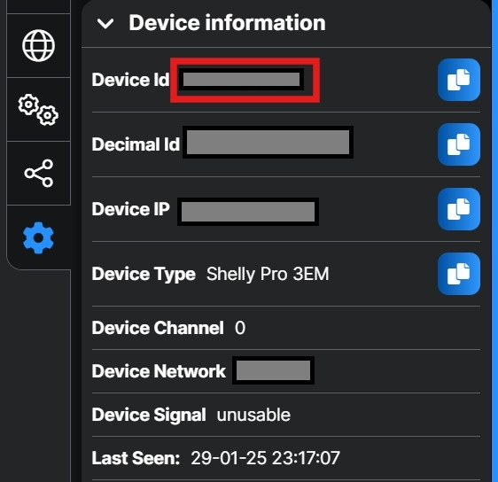

# Shelly Device Status Alerts via Scene notifications

This script tracks the online status of remote Shelly devices and triggers Shelly scenes to notify users when devices go offline or come back online.

## Table of Contents
- [Shelly Device Status Alerts via Scene notifications](#shelly-device-status-alerts-via-scene-notifications)
  - [Table of Contents](#table-of-contents)
  - [Features](#features)
  - [Requirements](#requirements)
  - [Installation](#installation)
      - [Create a Shelly script](#create-a-shelly-script)
      - [How to get the API key and URL:](#how-to-get-the-api-key-and-url)
      - [How to get the SceneId:](#how-to-get-the-sceneid)
      - [How to get the device id:](#how-to-get-the-device-id)
- [License](#license)
- [Author](#author)

## Features
- Monitors the online status of Shelly devices.
- Executes a Shelly Scene to notify the user when all devices go offline.
- Executes a Shelly Scene to notify the user when any device comes back online.

## Requirements
- Shelly devices to monitor
- Predefined Shelly Scenes in the cloud
- Shelly gen2 or never devices with scripting support

## Installation

#### Create a Shelly script
1. Optain a Shelly Plus, Pro or Gen3 device [Shelly devices](https://www.shelly.com/collections/smart-monitoring-saving-energy).
2. Connect the Shelly device to your personal WiFi network. Refer to the [Shelly web interface guides.](https://kb.shelly.cloud/knowledge-base/web-interface-guides)
3. The firmware of Shelly Gen2 Plus devices must be version 1.4.4 or higher. The KVS store is read only if the firmware version is 1.4.3 or older.
4. Open the Shelly device web page: Click Settings &rarr; Device Information &rarr; Device IP &rarr; click on the IP address. The Shelly device web page will open, on the left menu click "<> Scripts".
5. Create new script and copy-paste the code inside of the scripting window. 
6. Name the script, for instance, "Remote monitoring", and save. 
7. Click "Start" once the saving process is complete.
8. After the first run, the script stops and prompts you to fill in configuration parameters in KVS, such as API key, URL, etc.
9. Configure script parameters in KVS.
10. Add devices data inside of the script.
11. Start the script and in few minutes monitor the logs to cehck if everything works well. 

#### How to get the API key and URL:
1. Go to https://control.shelly.cloud/
2. Click on the Settings tab
3. Click on the "Authorization cloud key"
4. Click on the Get key button
5. Copy the key and save it in the KVS
6. Copy the Shelly cloud URL and save it in the KVS
   

#### How to get the SceneId:
1. Go to https://control.shelly.cloud/
2. Click on the Scenes tab
3. Click on the scene you want to use
4. Click on the Informaton tab
5. Copy the Scene ID and save it in the KVS
6. Repeat the steps for the other scene
   

#### How to get the device id:
1. Go to https://control.shelly.cloud/
2. Click on the room where the device is located
3. Click on the device you want to use
4. Click on the Device Settings tab
5. Open Device Information
6. Copy the DeviceId (MAC address) and save it in the script
7. Repeat the steps for the other devices
8. Do not use more than 5 devices in the script as it may cause memory issues
   

# License

This project is licensed under the MIT License. See the [LICENSE](LICENSE) file for details.

# Author

Created by Leivo Sepp, 2025

[GitHub Repository: Shelly Device Status Alerts via Scenes](https://github.com/LeivoSepp/Shelly-Device-Status-Alerts-via-Scenes)